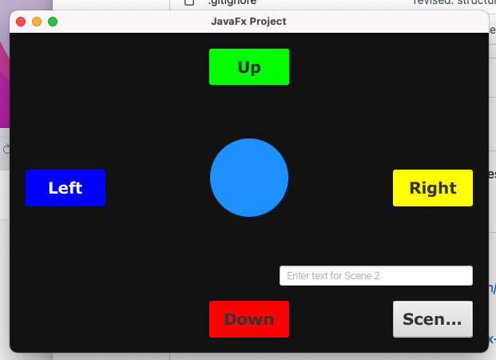
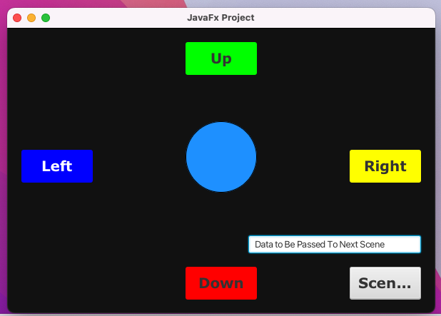
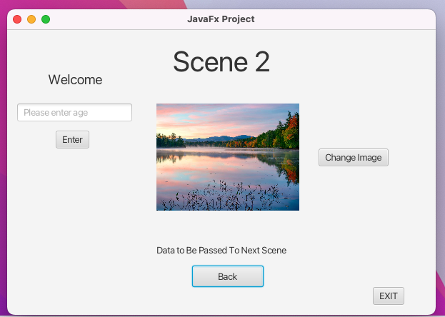
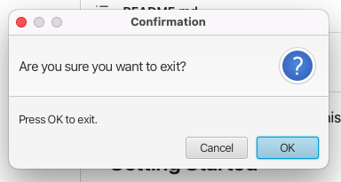
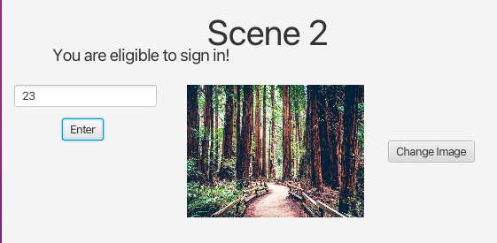

# JavaFx-basics

Using JavaFX and scene builder this project explores basics of JavaFx using VS Code as IDE.

### Homepage - Scene 1 - Using Scene Builder for JavaFx

#### Passing data to Scene 2

#### Scene 2

#### On Click Button Change Image - Image View

#### On Click Button Change Image - Image View

#### Exit Confirmation

#### Validation of User Input

## Getting Started

https://openjfx.io/openjfx-docs/

Setting Java_Home o n MacOS
https://mkyong.com/java/how-to-set-java_home-environment-variable-on-mac-os-x/

https://jenkov.com/tutorials/javafx/index.html#javafx-books

Oracle Client Technologies
https://docs.oracle.com/javase/8/javase-clienttechnologies.htm

Bro Code Playlist on JavaFx
https://www.youtube.com/playlist?list=PLZPZq0r_RZOM-8vJA3NQFZB7JroDcMwev

### Revisions to launch.json

Using Vs code update the "vmArgs": "--module-path <path to jar files of Javafx> --add-modules=javafx.controls,javafx.fxml"

If you change the package name, update the fully qualified name of the main class using the revised package name eg: main.Main

keep this as this one, not Launch Main
"name": "Launch App"

### Main.java

Make sure you point to the correct starting point fxml file
getResource("main.fxml"));

### Import Referenced libraries of JavaFX

inside the Java Projects in VS Code, attach referenced libraries and select all the JAR files of the JavaFx. This will include them in your project. Another way is to add them to the lib folder of the project as well.
